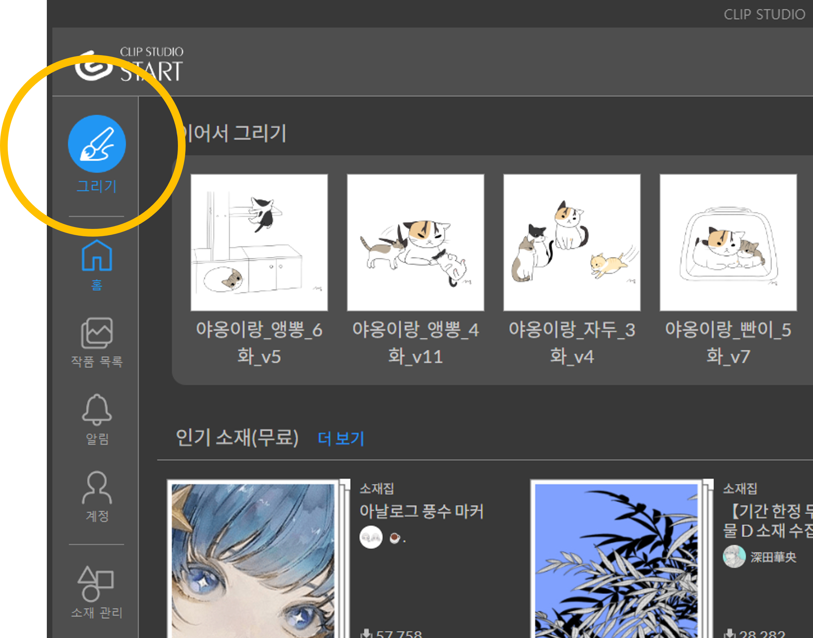
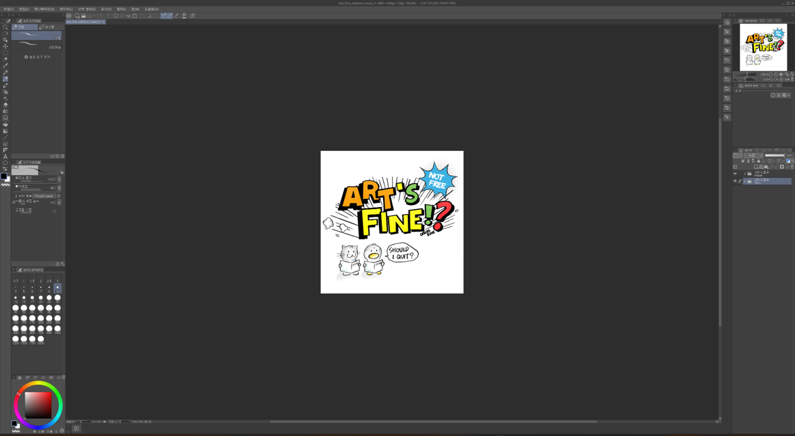
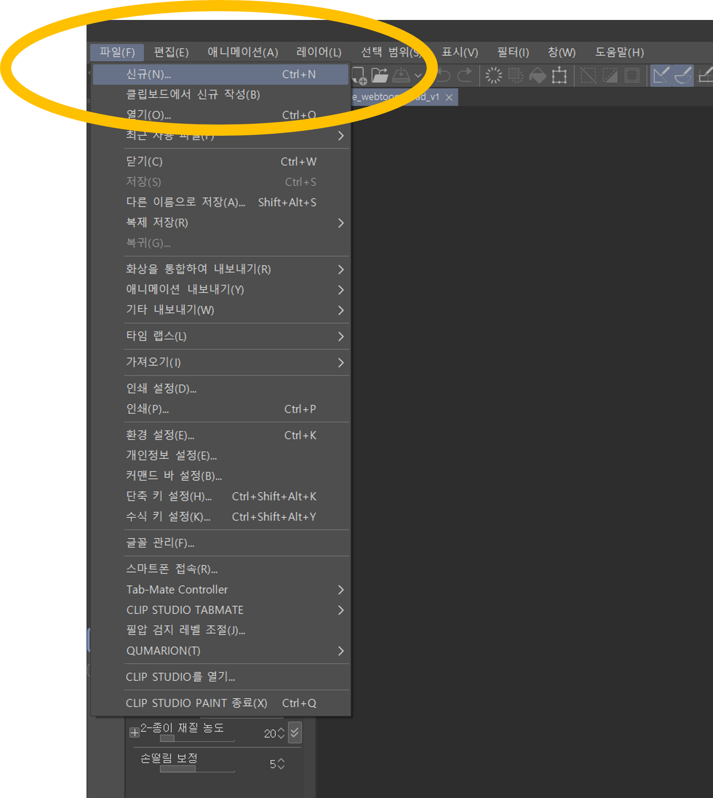
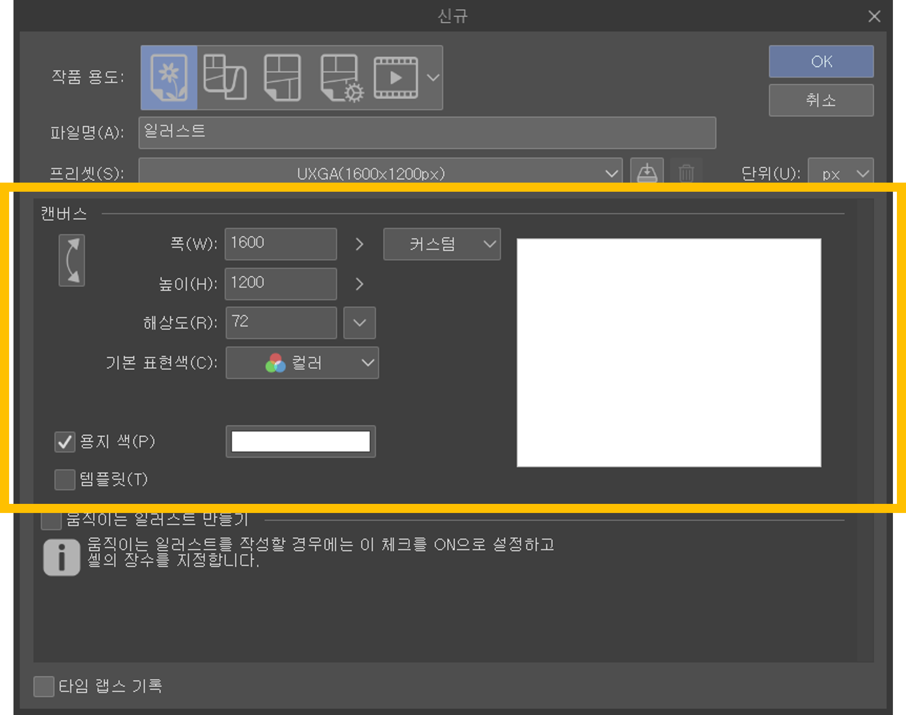
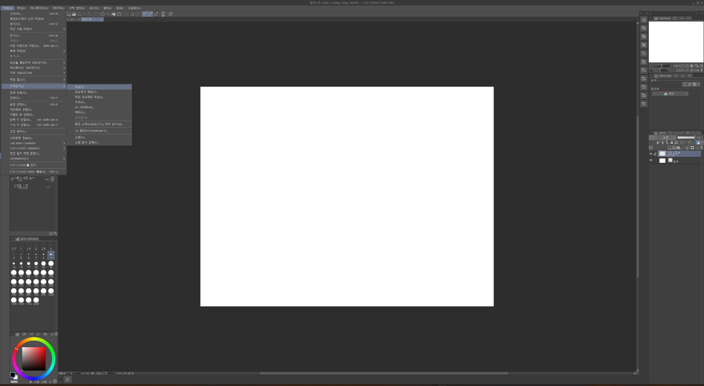

+++
draft = false
math = false
isCJKLanguage = true
author = "최은광"
title = "01강 | 새 캔버스 만들기"
description = "첫 실행, 페인트 구동, 새 캔버스 만들기"
date = 2023-05-01 18:38:00
expiryDate = 2099-12-31
techs = ["Celsys/ Clip Studio Paint"]
languages = "한국어"
+++

클립 스튜디오 아이콘으로 **클립 스튜디오**를 실행합니다.

#

#

이것은 **클립 스튜디오 페인트**에 진입하기 위한 초기 화면입니다. 로컬 및 클라우드의 작품 파일을 관리하거나 계정을 설정하는 등의 작업을 할 수 있습니다. 셀시스에서 제공하는 다방면의 팁도 볼 수 있고요. 하지만 여기서는 그림을 그릴 수 없습니다.

#

#

**클립 스튜디오 페인트**를 구동하기 위해 화면 왼쪽 위의 **그리기** 아이콘을 클릭합니다.

#

#

**클립 스튜디오 페인트**가 구동된 모습입니다. 포토샵과 비슷한 모양새를 하고 있습니다. 제가 작업하던 이미지가 열려 있군요. 기본 설정에서는 프로그램 종료 직전에 작업하던 작품을 불러와서 띄워 줍니다.

기존 작업은 무시하고, 새 캔버스를 준비해서 새로운 작품을 만들어 봅시다.

#

#

**파일 ▸ 신규**를 선택해 새 캔버스 도구 창을 열겠습니다.

#

#

새 캔버스 도구 창의 모습입니다. 복잡하게 설정할 것이 많지만, 지금은 창 중앙의 **①폭, ②높이, ③해상도, ④기본 표현색**만 설정해 줍시다.

#

#

설정한 대로 새 캔버스가 준비되었습니다.