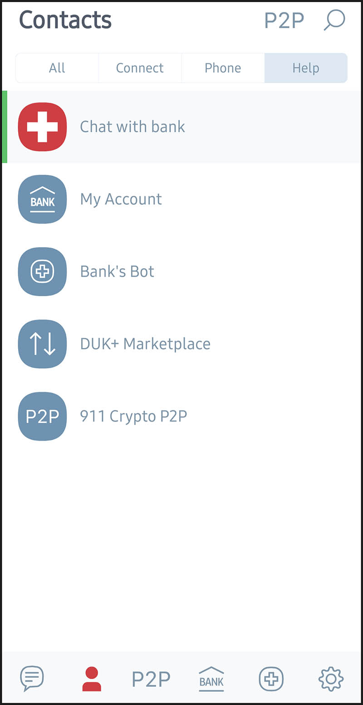
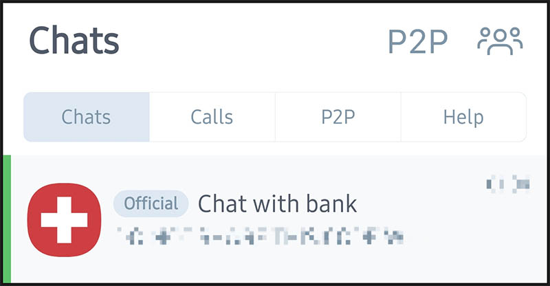

+++
draft = false
math = false
isCJKLanguage = true
author = "최은광"
title = "잔금은 스위스 계좌로 넣어 주시죠"
date = 2024-06-24
expiryDate = 2099-12-31
techs = ["Adobe/ Behance"]
etcs = ["Works/ 작업"]
languages = "한국어"
+++

저는 최근에 스위스 계좌를 열었습니다.

스위스 계좌가 왜 필요하냐고요? 마피아들이 돈세탁할 때나 이용하는 것 아니냐고요? 천만에요.

1인 사업자인 프리랜서에게는 국외 계좌가 퍽 유용하게 활용될 수 있습니다. 가령 어도비의 비핸스Behance 같은 플랫폼에서 자신의 디자인 상품을 판매하기 위해서는 반드시 본인 명의로 개설된 국외의 실물 계좌가 필요합니다. 비핸스는 우리나라 계좌를 지원하지 않기 때문이지요.

 

<ins class="adsbygoogle"
     style="display:block; text-align:center;"
     data-ad-layout="in-article"
     data-ad-format="fluid"
     data-ad-client="ca-pub-2618164900782657"
     data-ad-slot="9803941047"></ins>

 

국외 계좌는 그 특성상 개설하는 과정이 번거로울 수밖에 없는데요. 복잡한 서류가 다량 필요한 것은 물론이고, 은행을 직접 찾아가 대면으로 개설해야 하는 것은 또 말할 나위가 없죠.

하지만 제가 지금 알려드리려 하는 것은 **오로지 인터넷만을 사용해서 <red>온라인</red>으로 계좌를 개설하는 방법**입니다. 대단하죠? 비대면으로는 국내 계좌 만들기도 쉽지 않은 요즘, 심지어 스위스 계좌인데 말이에요.

#

# 국외 계좌의 필요성

#

사실 대부분의 경우에는 실제 계좌가 없더라도 충분히 해외 플랫폼 서비스를 이용할 수 있습니다. 요즘은 페이팔이나 **와이즈**Wise 같은 대체 금융 서비스가 무척 활성화되어 있죠. 저도 국외의 여러 판매 채널을 페이팔에 연결해 놓고 있습니다.

하지만 예외가 되는 경우도 적지 않습니다. 가령 **비핸스**는 대체 금융 서비스에 연결이 되어 있기는 하지만, 이 서비스가 특정 국가에서만 제공된다는 점이 문제가 되지요. 그 특정 국가에 우리나라는 포함이 되어 있지 않기 때문입니다. 어도비가 사용하는 대체 금융 서비스 **스트라이프**Stripe는 대한민국에서 제공되지 않습니다.

한국에 서비스를 제공할 여력이 없다는 스트라이프 담당자의 메일 답변. No worries가 아닌 것 같은데… 달러 취급 계좌라 해서 무조건 먹히는 게 아니라니까? 이 일이 만만치 않다는 점을 이해시키기가 쉽지 않다.

비핸스와 같은 플랫폼을 판매자로서 이용하려면, 결국 이 플랫폼을 지원하는 국가에서 발행한 계좌가 필요하게 됩니다. 외환을 취급하는 국내 계좌라면 저도 이미 여러 개 가지고 있습니다. 요즘은 꼭 외환은행이 아니더라도 어디서나 편하게 외환 업무를 볼 수 있으니까요. 그러나 결국은 저 역시 위와 같은 이유로 국외 계좌를 개설할 수밖에 없게 되었습니다.

#

# 국외 계좌 개설의 어려움

#

현재 우리나라에서 외국인의 자격으로 계좌를 개설할 수 있는 국외 은행은 없습니다. 홍콩 기반의 HSBC 은행이 아직 국내에서 영업을 하고 있긴 하지만, HSBC 은행에서는 더 이상 신규 계좌 개설 업무를 취급하고 있지 않습니다. 여타 외국 은행도 사정은 비슷하구요. 그래서 대안을 찾을 수밖에 없습니다.

인터넷으로 계좌를 개설할 수 있는 국외 은행의 수가 코로나 기간 동안 많이 늘어났습니다. 지금은 좀 주춤한 추세이고요. 최근에는 경향이 뒤집어져서 대다수 은행이 오히려 신규 가입을 받지 않고 있습니다.

예상하시겠지만 이렇게 개설한 계좌를 범죄에 악용한 사례가 제법 있었다고 합니다. 비대면으로 계좌를 개설하는 데다 외국인 신분으로 접근하는 것도 가능하니 돈세탁하는 입장에서는 매력적이었던 것일까요? 이는 은행들이 신규 계좌 개설을 꺼리게 된 주요한 원인이 되었습니다.

한때 독일의 N26 은행도 이 분야에서 인기를 끌었지만, 이곳 역시 최근에는 신규 계좌 접수를 하고 있지 않습니다. 다만 계좌 개설 업무를 완전히 폐쇄하지는 않은 듯, 언젠가 다시 오픈할 수 있으리라는 여지를 남겨두고 있네요. 재오픈할 때를 대비하여 이메일 알람 접수를 하고 있습니다.

N26 은행의 대기 명단 접수 안내. 그래서 언제 다시 시작하신다굽쇼...?

저도 대기 명단에 등록을 해두었습니다. 하지만 언제 다시 업무가 오픈될지, 예정이나 계획에 대한 설명은 전혀 없군요. 해서 좀 막막한 느낌은 있습니다.

오늘 알려드릴 국외 은행은 스위스의 **두카스방크**입니다. 현 상황에서 국외 계좌를 개설할 수 있는, 사실상 유일무이한 대안이라 할 수 있겠습니다.

#

# 두카스방크

#

**두카스방크**Dukasbank는 2004년에 설립된 스위스의 대표적인 금융기관입니다. 외환 거래와 자산 관리를 전문으로 하는 은행이고요. 스위스 은행답게 비밀 유지와 철저한 보안으로 명성이 높습니다. 주 고객층에는 역시 프리랜서와 같은 1인 사업자가 많은 것으로 알려져 있습니다.

자, 이제 본론으로 들어가 볼까요? 두카스방크에서 계좌를 개설해 보도록 하겠습니다. 준비물은 **여권**입니다. 간단하죠?

그런데...

#

<h2>계좌 개설 신청에는 시간이 소요됩니다.</h2>

#

네, 그렇습니다. 시간이 소요됩니다. 그것도 아주 긴 시간이 소요됩니다.

여러 사례를 종합해 보면 이것은 개인차가 있는 것 같은데요. 제 경우는 절차를 완전히 마무리하기까지 거의 반년 가까운 시간이 소모되었답니다. 좀 운이 나쁜 케이스였다고 볼 수도 있겠지요. 이 점을 미리 고려하셔서 여유 있게 계좌 개설 계획을 잡으시기 바랍니다.

#

# 계좌 개설 신청

#

먼저 두카스방크 웹사이트에서 계좌 개설 신청서를 작성합니다.

앱으로 신청하셔도 됩니다. 저는 오히려 이 방법을 권장합니다. 어차피 이후의 커뮤니케이션에 앱이 필요하거든요. 한글은 지원되지 않아요. 구글 플레이스토어에서 **Dukascopy Connect 911** 앱을 검색하여 설치합니다. 앱스토어에서도 같은 이름으로 검색됩니다.

앱을 검색하여 설치합니다. 두카스방크 그룹의 계열 앱이 많으니 주의 깊게 확인하세요.

#

# 비대면(전화) 검증

#

신청서가 제출되면 스위스 본점에서 직원이 다이렉트로 전화를(...!) 걸어옵니다.

앱 화면의 일부. 맨 위의 Chat with Bank 탭에서 은행과 직접 커뮤니케이션합니다.

911 앱은 일종의 메신저입니다. 앱 내에서 채팅과 전화를 할 수 있게 되어 있지요. 전화 역시 이 앱을 통해서 걸려 옵니다. 기본적인 영어 회화가 필요합니다.

두카스방크 로고와 Official 배지를 확인합시다.

사전 질문. 본인 검증 서류로 여권을 사용할 것인지 신분증을 사용할 것인지 묻습니다. 저는 여권을 선택했습니다.

여권 사진을 찍어서 올리라고 요구하는군요. 이 여권은 통화 과정에서 한 번 더 검증해야 합니다.

전화하기 직전에 담당자가 “지금 통화 가능하시냐”라는 취지로 텍스트 채팅을 걸어옵니다. 그렇다고 답변하면 곧바로 통화가 시작됩니다. 국가 간 시차를 고려해 주는 것 같지는 않습니다. 저는 밤 열 시 가까이 되어서야 통화를 시작했답니다.

드디어 통화가 시작되는 순간입니다.

제게 연락하신 담당자는 독일어 억양이 강했습니다.

“메이 아이 아스크 유어 **_푸르_** 네임, 써?”
“암... 왓 더... **_푸르_** 네임...?”
“예스, **_푸르_** 네임, 써.”

대체 저놈의 _**푸르**_ 네임이 뭘까. 나의 스위스 계좌 개설은 이것으로 좌초되는 것인가. 짧은 순간 많은 생각이 스쳐갔습니다.

네, _**푸르**_ 네임이라는 것은 **풀**(full) 네임을 말하는 것이었던 것입니다. 이렇게 본명과 생년월일 정도를 말하라고 시킵니다. 제가 담당자의 말을 잘 알아듣지 못해서 처음에 고생을 좀 했네요.

 

<ins class="adsbygoogle"
     style="display:block; text-align:center;"
     data-ad-layout="in-article"
     data-ad-format="fluid"
     data-ad-client="ca-pub-2618164900782657"
     data-ad-slot="9803941047"></ins>

 

그러고서 여권을 카메라 가까이 가져오도록 주문합니다. 아마도 여권의 위조 여부를 확인하는 것 같은데요. 식별 문구가 정상적으로 인쇄되었는지, 홀로그램은 바르게 나타나는지 따위를 검토한다고 합니다.

“클로저(closer)... 클로저...” 여권을 아주 가까이로 가져오도록 주문합니다. 이쯤이면 되지 않았을까 싶을 때쯤 조금 더 들이대야 합니다.

이것으로 검증 절차는 마무리됩니다. 메일이 갈 거라는 말 한마디를 남기고 전화는 쿨하게 끊어졌습니다.

이제 고비는 넘겼다...

저뿐만 아니라 누구든 그렇게 생각했을 겁니다.

본인 검증 절차를 마치고 통화가 마무리되었습니다.

#

# 존버의 대환장 파티

#

하지만 안도하기는 일렀습니다. 네, 우리가 상대하는 것은 고객을 대하는 태도가 여유롭기 짝이 없는 유럽 은행이었던 것입니다.

한 달이 지나고, 두 달이 지나도 이렇다 할 소식이 없었습니다. 기다림에 지친 제가 채팅을 시도해 보았으나, 돌아오는 것은 챗봇의 무성의한 메아리뿐…

미리 말해 두지만, I was not asking that 을 선택한다 해서 뾰족한 방법이 나오는 것은 아니에요. ‘상담원과 통화’ 버튼 따위는 없습니다.

메아리 둘.

메아리 셋. 그래도 이번에는 사람이 답해주었다ㅠ

(드디어) 계좌 개설 승인

하지만 쥐구멍에도 볕들 날이… (이런 데 쓰는 말 아닙니다.) 마침내 계좌 개설 신청 서류가 승인되었다는 통지는 오고야 말았습니다. 자그마치 석 달을 기다린 끝에 받은 메시지입니다.

흐미 기쁜 거... 하지만 아직 한발 남았다

#

# (진짜) 계좌 개설

#

아직 해야 할 일이 남았습니다.

계좌 개설이 승인되었는데 무슨 할 일이 더 있느냐고요? 화면을 위로 올려서 소제목을 확인해 보세요. 우리가 승인받은 건 **계좌를 개설하겠다는 신청**이지 **계좌 개설** 그 자체가 아니었거든요. <del>내가 석 달을 기다린 것은 계좌를 만들기 위한 추진력을 얻기 위함이었다.</del> 가만 보면 유럽 애들도 말장난 장난 없어.

하지만 여기까지 오셨다면 지금부터는 시간문제입니다. 앱으로 전송되어 온 링크와 코드를 이용해서 계좌를 (진짜로) 개설합니다.

여기서부터의 과정은 보안상 생략할 수밖에 없겠군요. 하지만 단언컨대, 기다림보다 더 어려운 과정은 없습니다. 틀림없이 수월하게 남은 계좌 개설 절차를 마무리하실 수 있을 겁니다.

계좌 개설을 성공적으로 마무리한 뒤, 웹에서 발급받은 예금 증서. 맨 위에 저의 푸르... 네임이 보이는군요.

#

# 끝!

#

드디어 끝났습니다. 스위스 계좌를 만들었습니다. 이제 남은 일은 돈을 벌어서 계좌에 잘 쌓는 것이 되겠군요. 하지만 조심하세요. 너무 큰 금액이 오가면 마피아로 의심받을 수도 있거든요. 반 농담이지만 반쯤은 진담입니다.

외화벌이로 국위 선양에 이바지하시길! 언제나 응원하겠습니다.

#