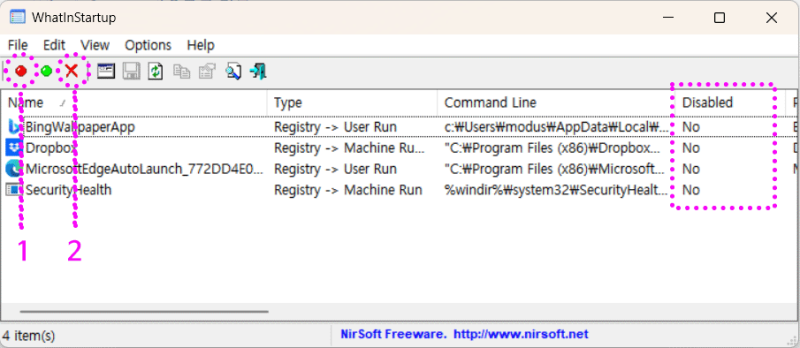
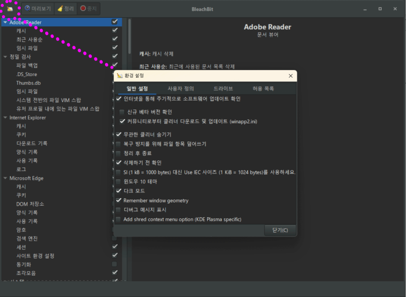

+++
draft = false
math = false
isCJKLanguage = true
author = "최은광"
title = "기존 설치된 MS (오피스) 365가 제거되지 않을 때 대처법"
date = 2024-06-17
expiryDate = 2099-12-31
techs = ["Microsoft/ MS (Office) 365"]
etcs = ["Works/ 작업"]
languages = "한국어"
+++

# 1. DISM 및 SFC 툴로 설치 정보 정리하기  

#

통상적인 방법으로 MS 오피스가 삭제·제거되지 않는 경우, 기기 내부 정보가 혼잡해져 있을 가능성이 높습니다. 윈도우에서 제공하는 기본 툴 두 가지(`DISM`, `SFC`)로 이 정보를 빠르게 정리해 줄 수 있습니다.  
  
우선 명령 프롬프트를 관리자 권한으로 실행합니다.  

#

1. ​윈도우 키(<kbd>⊞</kbd>) + <kbd>s</kbd> → **검색** 창이 표시됩니다  
2. 검색 창에서 `명령 프롬프트`​ 입력 → 창 오른쪽에 단축 메뉴가 표시됩니다  
3. 오른쪽 단축 메뉴에서 `관리자 권한으로 실행` 선택  

#

**명령 프롬프트**가 실행되면 다음 명령어를 한 줄씩 입력하세요. <mark>이전 명령어가 작업을 완전히 끝낸 뒤에 다음 명령어를 입력하셔야 합니다.</mark>

#


dism.exe /online /cleanup-image /scanhealth  
dism.exe /online /cleanup-image /restorehealth  
dism.exe /online /cleanup-image /startcomponentcleanup  
sfc /scannow  

​  
각 명령어가 기기 내부의 앱 설치 정보를 정리하고 최적화합니다. 오류가 발생할 경우 `명령 프롬프트` 대신 `Powershell`을 실행하여 재시도해 봅니다.  

 

<ins class="adsbygoogle"
     style="display:block; text-align:center;"
     data-ad-layout="in-article"
     data-ad-format="fluid"
     data-ad-client="ca-pub-2618164900782657"
     data-ad-slot="9803941047"></ins>

 

# 2. MS에서 권장하는 공식 절차에 따라 제거 시도  

#

기기 내부 정보를 정리했다면 이제 본격적으로 오피스를 제거할 순서입니다. 웹에는 이런저런 팁이 많이 돌아다니지만, 역시 MS가 제안하는 절차부터 모두 수행해 보는 것이 기본입니다.  
  
우선 다음 1단계에 따라 제거를 시도해 봅니다.  

<a href="https://support.microsoft.com/ko-kr/office/pc%EC%97%90%EC%84%9C-office-%EC%A0%9C%EA%B1%B0-9dd49b83-264a-477a-8fcc-2fdf5dbf61d8#OfficeVersion=%EA%B0%84%ED%8E%B8_%EC%8B%A4%ED%96%89_%EB%98%90%EB%8A%94_MSI" target="_blank" rel="noopener noreferrer"><h4><b>마이크로소프트 공식 권장 절차 - 1단계</h4></b></a>

#

1단계에서 제안하는 방법을 모두 시도했는데도 오피스를 완전히 제거할 수 없다면, 다음 2단계의 방법을 시도해 봅니다.
  

<a href="https://support.microsoft.com/ko-kr/office/%EC%88%98%EB%8F%99%EC%9C%BC%EB%A1%9C-office-%EC%A0%9C%EA%B1%B0-4e2904ea-25c8-4544-99ee-17696bb3027b" target="_blank" rel="noopener noreferrer"><h4><b>마이크로소프트 공식 권장 절차 - 2단계</h4></b></a>

 

# 3. 검증되지 않은 방법으로 제거 시도  

#

여기까지 따라왔는데도 제거가 되지 않는다면, 이제는 별도리가 없습니다. ​어둠의... 팁을 따르는 수밖에요.  
  
사실 이쯤 되면 기기를 포맷하시라 권해드리고 싶지만, 그래도 시도해 볼 방법이 아주 없는 것만은 아닙니다. 서드파티 앱으로 기기 내부 정보를 빡세게 정리해 볼 수 있습니다.  
  
<abbr title="3rd Party Applications">서드파티 앱</abbr>이란 제조사가 만든 앱이 아닌 외부의 앱을 의미합니다. 여기서는 마이크로소프트가 직접 만들지 않은 앱이 되겠지요. 대개는 MS에서 그 성능을 보증하지 않습니다.  
  
네, 그렇습니다. 이제부터는 다소 아슬아슬하니 위험한 길이 될 수 있습니다. <del>그래서 그냥 포맷하시는 편이 낫다는...</del> 아래 절차는 반드시 백업과 복원 지점 설정을 완료하신 뒤 수행하실 것을 권합니다.  

 

<ins class="adsbygoogle"
     style="display:block; text-align:center;"
     data-ad-layout="in-article"
     data-ad-format="fluid"
     data-ad-client="ca-pub-2618164900782657"
     data-ad-slot="9803941047"></ins>

 
  
## 1단계 - 시작 프로그램 및 서비스 정리  
  
통상적인 절차에 따라 제거되었어야 마땅할 파일이 여전히 남아 있는 경우가 있습니다. 특히 실행 파일의 일부는 윈도우 구동 시 함께 실행되어 메모리에 상주할 수 있습니다.  
  
아래의 세 단계는 이렇듯 불필요한 프로세스를 꺼주는 절차입니다. 각 단계를 마무리할 때마다 시스템을 재부팅하고 오피스 제거를 시도해 보세요.  

### (1) msconfig

1. 윈도우 키(<kbd>⊞</kbd>) + <kbd>r</kbd> → **실행** 창이 표시됩니다  
2. 실행 창에 `msconfig` 입력 → **시스템 구성** 창이 표시됩니다  
3. 시스템 구성 창에서 `시작 프로그램` 탭 선택한 뒤 `작업 관리자 열기` 선택  
4. **사용**으로 되어 있는 앱의 상태를 **사용 안함**으로 변경 (앱을 우클릭하면 변경할 수 있는 단축 메뉴가 나타납니다)  

### (2) services.msc  
  
1. 윈도우 키(<kbd>⊞</kbd>) + <kbd>r</kbd> → **실행** 창이 표시됩니다  
2. 실행 창에 `services.msc` 입력 → **서비스** 창이 표시됩니다  
3. 서비스 창에서 오피스 관련 서비스 중지 (서비스 항목을 우클릭하면 변경할 수 있는 단축 메뉴가 나타납니다)  
  
**경고!** <mark>서비스에 따라서는 중지하는 것만으로 윈도우 구동을 불가능하게 만들 수 있습니다.</mark> 포맷을 각오한 경우에만 시도하세요!  

### (3) WhatInStartup  
  
검색 엔진에서 `WhatInStartup`을 검색하거나 다음 링크를 따라가서 프로그램을 다운로드합니다.

[WhatInStartup 다운로드 링크](https://www.nirsoft.net/utils/what_run_in_startup.html)  
​  
중간쯤에 프로그램을 다운로드하실 수 있는 링크가 가운데 정렬로 삽입되어 있습니다. 프로그램을 받아서 실행합니다. 시스템 구동 시 자동 실행되는 프로그램이 나열됩니다.  

​
  
**1**을 눌러 프로그램을 비활성화하거나 ​**2**를 눌러 제거합니다.  
  
여기서 제거하더라도 시작 프로그램 목록에서만 사라질 뿐 프로그램을 완전히 지우는 것은 아닙니다. 그러나 경우에 따라서는 시스템의 구동에 영향을 줄 수도 있으므로, 확신할 수 없는 경우에는 **​1**​을 눌러 비활성화만 시키시기 바랍니다.  
  
비활성화된 프로그램은 오른쪽 **Disabled** 탭에 **Yes**로 표시됩니다. **2**를 눌러 제거한 프로그램은 목록에서 아예 사라집니다.

## 2단계 - 캐시, 레지스트리, 기타 등등 정리  
  
프로그램의 일부가 완전히 제거되지 않았을 경우, 설치 프로그램이 혼란을 일으킬 수 있습니다. 프로그램이 이미 설치되어 있는 것으로 오인하면서 설치 프로세스가 제대로 마무리되지 않는 것이지요.  
  
아래 절차는 이를 깨끗이 비워내기 위한 몇 가지 방법입니다. 각 단계를 마무리할 때마다 시스템을 재부팅하고 오피스 제거를 시도해 보세요.

### (1) 디스크 정리

1. ​윈도우 키(<kbd>⊞</kbd>) + <kbd>s</kbd> → **검색** 창이 표시됩니다  
2. 검색 창에서 `디스크 정리` 입력 → 창 오른쪽에 단축 메뉴가 표시됩니다  
3. 오른쪽 단축 메뉴에서 `관리자 권한으로 실행` 선택  
4. 삭제할 파일을 모두 선택한 뒤 `확인`을 눌러 진행  
  
<mark>**기타 옵션** 탭은 접근하지 않는 편이 좋습니다.</mark>

### (2) BleachBit

검색 엔진에서 `BleachBit`을 검색하거나 다음 링크를 따라가서 프로그램을 다운로드합니다.  
  
[BleachBit 다운로드 링크](https://www.bleachbit.org/download)  
​  
다운로드한 프로그램을 실행합니다. 왼쪽 위의 아이콘을 눌러 메뉴를 열고 환경 설정 창을 선택합니다.  
  
환경 설정의 선택 항목을 아래와 같이 변경합니다. **winapp2.ini** 파일이 다운로드되면서 정리할 수 있는 항목이 늘어납니다.  

​

`닫기`를 눌러 환경 설정에서 빠져나온 뒤, 오른쪽 위의 <kbd>×</kbd> 단추를 눌러 프로그램을 종료하고 재실행합니다.

프로그램 왼쪽 패널에서 정리할 항목을 선택한 뒤, `정리`를 눌러 진행합니다.

**경고!** <mark>저장되어 있던 사용자 정보가 사라지거나 일부 프로그램의 구동이 불가능하게 될 수 있습니다!</mark>

### (3) CleanGenius  
  
검색 엔진에서 `CleanGenius`를 검색하거나 다음 링크를 따라가서 프로그램을 다운로드합니다.  
  
[CleanGenius 다운로드 링크](https://www.easeus.com/cleangenius/download.htm)  
​  
다운로드한 프로그램을 실행합니다. 맨 위의 탭을 실행하는 것만으로 어지간한 잡동사니는 다 삭제됩니다.  
  
​이 프로그램의 문제는... 종종 필요한 파일까지 싹 날려버린다는 점이지요. 포맷 직전에나 지푸라기 잡는 심정으로 써 보시는 편이 좋습니다.