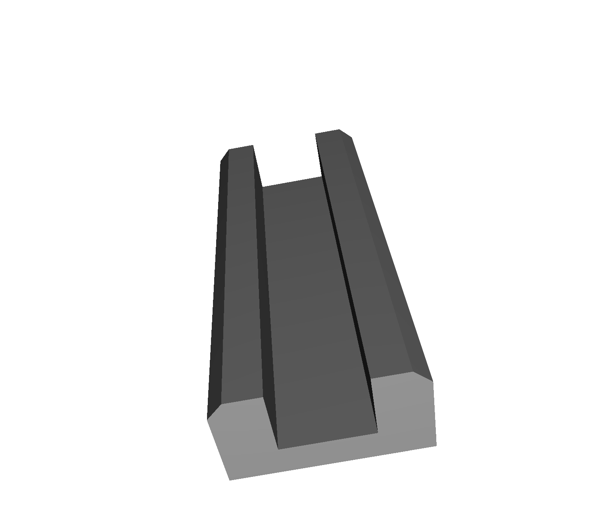
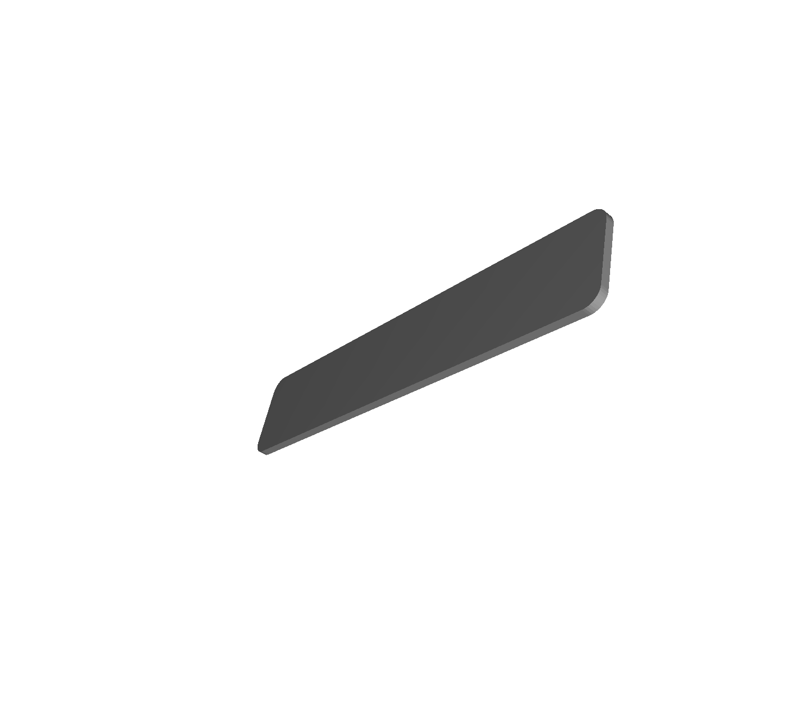
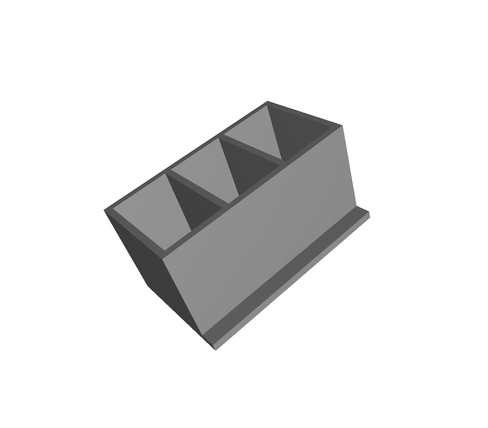
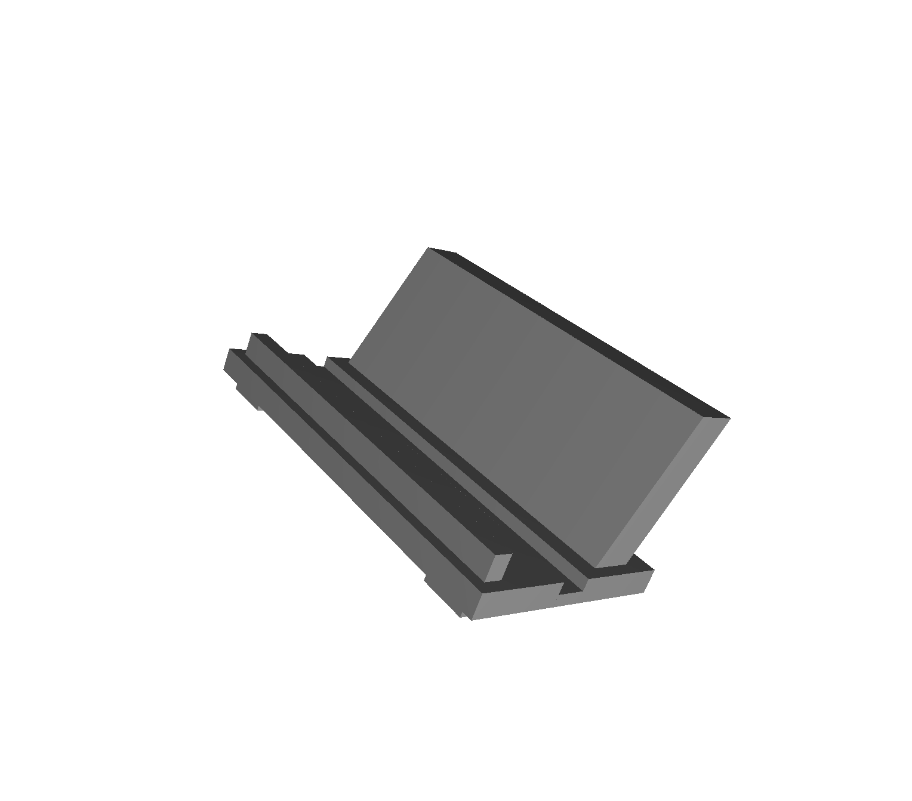

+++
draft = false
toc = true
math = false
isCJKLanguage = true
author = "최은광"
title = "05강 | Modifier Workflow"
description = "오브젝트 역설계"
date = 2026-05-01 00:00:00
expiryDate = 2099-12-31
techs = ["Blender Foundation/ Blender 5"]
languages = "한국어"
+++

블렌더 5 모델링의 기초 | 광진정보도서관 2026년 상반기 특강

<!--more--> 

# 1. 강의 개요

<h3>강의명</h3>

Modifier Workflow  
— 오브젝트 역설계

<h3>강의 목표</h3>

- 최종 결과물의 구조를 역방향으로 분석할 수 있다.
- 기능형 오브젝트를 요소에 따라 분해할 수 있다.
- Edit와 Modifier 중 적합한 방식을 판단할 수 있다.
- Modifier를 조합하여 수정 가능한 구조를 만들 수 있다.
- 3D 프린팅을 고려하여 제작 경로를 설계할 수 있다.

<h3>실습의 흐름</h3>

1. 케이블 정리 클립 — Inset, Extrude, Bevel
2. 미니 책갈피 — Solidify, Scale
3. 미니 필통 — Array
4. 카드 홀더 — Boolean Difference, Bevel
5. 공통 구조 비교 — Edit 중심 vs Modifier
6. 최종 경로 선택 — Modifier 조합 및 Apply

 

# 2. 실습

## 실습 1. 케이블 정리 클립 

— Inset, Extrude, Bevel의 실습  

1. Cube 선택
2. `S` → X, Y 축 방향으로 얇게 만들어 기본 판 형태 생성
3. `Tab` → Edit Mode 진입
4. `3` → Face 선택 모드
5. 상단 Face 선택
6. `I` → Inset 실행 (클립 내부 공간 확보)
7. `E` → Extrude → 아래 방향으로 이동 (홈 구조 생성)
8. 바깥 Edge 선택 (`2` → Edge 선택 모드)
9. `Ctrl` + `B` → Bevel 실행 (모서리 완화)
10. 필요 시 앞쪽 Edge를 선택하여 `G`로 살짝 이동하여 클립 형태 조정



### 오류 1. Inset이 제대로 작동하지 않는다

원인

- Face가 아닌 Vertex 또는 Edge 선택 상태

해결

- `3` → Face 선택 모드로 전환 후 다시 실행

### 오류 2. Extrude가 단순 이동처럼 보인다

원인

- Extrude 후 바로 이동하지 않음
- 기존 면을 이동한 것으로 착각

해결

- `E` 입력 후 마우스를 움직여 새 면이 생성되었는지 확인
- 필요 시 `E` → `Z`로 방향 제한

### 오류 3. 홈이 너무 얕거나 너무 깊다

원인

- Extrude 거리 조절 미숙

해결

- `Ctrl` + `Z`로 되돌린 뒤 다시 Extrude
- 또는 수치 입력으로 깊이 조절

### 오류 4. Bevel이 적용되지 않는다

원인

- Edge가 선택되지 않음
- Vertex 또는 Face 선택 상태

해결

- `2` → Edge 선택 모드로 전환
- 모서리 Edge 선택 후 다시 실행

### 오류 5. Bevel 결과가 깨진다

원인

- 구조가 너무 단순하거나 Edge가 겹침
- Bevel 값이 너무 큼

해결

- Bevel 값을 줄여서 적용
- 필요 시 Loop Cut으로 구조 보강

### 오류 6. 형태가 클립처럼 보이지 않는다

원인

- 기본 판 두께 또는 비율이 부적절
- Extrude 방향이 잘못됨

해결

- Object Mode에서 Scale 재조정
- 홈 방향을 다시 확인하고 수정




[practice-05-01.stl](practice-05-01.stl)


## 실습 2. 미니 책갈피

— Solidify, Scale의 실습  

1. Cube 선택
2. `S` → X, Y 축 방향으로 얇고 긴 판 형태로 조정
3. `S` → Z 축 방향으로 얇게 만들어 기본 평판 구조 생성
4. Object Mode에서 Modifier 패널 열기
5. Add Modifier → Solidify 추가
6. Thickness 값을 조절하여 실제 두께 부여
7. `R` → 약간 회전하여 형태 확인
8. `S`로 전체 크기 조정
9. `Ctrl` + `A` → Scale 적용
10. 필요 시 Edge 선택 후 `Ctrl` + `B`로 모서리 간단히 정리



### 오류 1. Solidify를 적용했는데 변화가 보이지 않는다

원인

- Thickness 값이 너무 작음
- 기존 두께가 이미 있음

해결

- Thickness 값을 크게 조절
- 측면에서 확인

### 오류 2. 두께가 이상한 방향으로 생긴다

원인

- Offset 값이 기본값이 아님

해결

- Solidify 옵션에서 Offset을 0 또는 1로 조정
- 원하는 방향으로 두께 생성

### 오류 3. Scale 후 형태가 이상해진다

원인

- Scale을 여러 번 적용하여 내부 값이 꼬임

해결

- `Ctrl` + `A` → Scale 적용
- 이후 다시 Scale 조정

### 오류 4. Apply Scale 후 방향이 달라진 것처럼 보인다

원인

- 회전 상태에서 Scale 적용

해결

- 필요 시 Rotation도 함께 확인
- 작업 전 Orientation (Global/Local) 점검

### 오류 5. 너무 얇거나 두꺼워 출력이 어려운 구조가 된다

원인

- Solidify 두께 설정 미숙

해결

- 최소 두께를 확보 (1~2mm 이상)
- Wireframe으로 두께 확인

### 오류 6. 모서리가 너무 날카롭다

원인

- Bevel 미적용

해결

- Edge 선택 후 `Ctrl` + `B`로 소량 적용




[practice-05-02.stl](practice-05-02.stl)


## 실습 3. 미니 필통

— Array의 실습  

1. Cube 선택
2. `S` → X, Y 축 방향으로 바닥판 형태로 조정
3. `S` → Z 축으로 얇게 만들어 기본 판 생성
4. `Tab` → Edit Mode
5. `3` → Face 선택 모드
6. 상단 Face 선택
7. `I` → Inset 실행 (칸 구조 준비)
8. `E` → Extrude → 위 방향으로 이동 (벽 구조 생성)
9. `Tab` → Object Mode 복귀
10. Modifier 패널에서 Add Modifier → Array 추가
11. Count 값을 증가시켜 칸을 반복 생성
12. Relative Offset 값을 조절하여 간격 맞추기
13. 필요 시 Z 방향으로도 Offset 조절하여 높이 확인



### 오류 1. Array를 적용했는데 변화가 없다

원인

- Count 값이 1로 설정됨

해결

- Count 값을 2 이상으로 증가

### 오류 2. 오브젝트가 겹쳐서 보인다

원인

- Offset 값이 너무 작음

해결

- Relative Offset 값을 증가
- X, Y 값을 조정하며 간격 확보

### 오류 3. 반복 방향이 이상하다

원인

- 잘못된 축 방향으로 Offset 설정

해결

- X, Y, Z 중 하나씩 변경하여 원하는 방향 확인

### 오류 4. 필통 형태가 아니라 단순 판처럼 보인다

원인

- Extrude 높이가 너무 낮음

해결

- `E` → `Z`로 충분한 높이 확보

### 오류 5. 일부만 반복되고 구조가 끊긴다

원인

- Edit Mode 상태에서 Modifier 적용 확인이 어려움

해결

- Object Mode에서 Modifier 결과 확인

### 오류 6. 반복된 구조가 너무 많거나 적다

원인

- Count 값 설정 미숙

해결

- Count 값을 단계적으로 조정

### 오류 7. 구조가 찌그러져 보인다

원인

- Scale이 적용되지 않은 상태

해결

- `Ctrl` + `A` → Scale 적용 후 다시 확인




[practice-05-03.stl](practice-05-03.stl)


## 실습 4. 카드 홀더

— Boolean Difference, Bevel의 실습  

1. Cube 선택
2. `S` → X, Y 축 방향으로 넓게 만들어 바닥판 형태 생성
3. `S` → Z 축으로 얇게 만들어 기본 판 두께 설정
4. `Shift` + `D`로 Cube를 복제하여 지지대 역할 오브젝트 생성
5. 복제된 오브젝트를 `G` → `Z`로 위쪽으로 이동
6. `R` → `X`로 약간 기울여 카드가 기대는 각도 형성
7. 원본 Cube 선택
8. `Shift` + `D`로 또 하나 복제하여 홈을 만들 오브젝트 생성
9. 복제된 오브젝트를 `S` → `X`로 얇게 만들고 바닥판 위에 위치시킴
10. 바닥판(Cube) 선택
11. Modifier 패널에서 Add Modifier → Boolean 추가
12. Operation → Difference 선택
13. Object → 홈용 Cube 선택
14. 홈이 생성되는지 확인
15. Edge 선택 모드(`2`)로 전환
16. 바닥판 모서리 선택
17. `Ctrl` + `B` → Bevel 실행하여 모서리 완화



### 오류 1. Boolean 적용 후 변화가 없다

원인

- 두 오브젝트가 겹치지 않음

해결

- 홈용 Cube가 바닥판을 충분히 관통하도록 위치 조정

### 오류 2. 홈이 이상한 위치에 생성된다

원인

- Boolean 대상 오브젝트 위치 오류

해결

- 홈용 Cube를 정확한 위치에 배치
- Top View에서 위치 확인

### 오류 3. 형태가 깨지거나 구멍이 비정상적으로 생성된다

원인

- 메시 구조 부족
- Scale 미적용

해결

- `Ctrl` + `A` → Scale 적용
- 단순한 구조에서 다시 시도

### 오류 4. 지지대 각도가 어색하다

원인

- 회전 기준(Global/Local) 혼동

해결

- `R` → `X` 사용
- Transform Orientation 확인

### 오류 5. Bevel이 적용되지 않는다

원인

- Edge 선택이 안 되어 있음

해결

- `2` → Edge 모드 확인 후 다시 실행

### 오류 6. Bevel 결과가 과도하게 둥글다

원인

- 값이 너무 큼
- Segment 과다

해결

- Bevel 두께 감소
- 휠로 Segment 수 조절

### 오류 7. 홈과 지지대가 겹쳐 보인다

원인

- 오브젝트 배치 순서 문제

해결

- 각각의 위치를 분리하여 확인
- 필요 시 이동하여 구조 재정렬




[practice-05-04.stl](practice-05-04.stl)


## 실습 5. 3D 프린팅 준비

1. 출력할 오브젝트 선택
2. 불필요한 오브젝트 삭제 또는 숨김
3. `Ctrl` + `A` → Scale 적용
4. `N` → Location, Rotation, Scale 값 확인
5. `Z` → Wireframe 또는 Overlay → Wireframe 체크
6. 모델 구조(두께, 구멍, 내부 면) 확인
7. `Alt` + `N` → Recalculate Outside (면 방향 정리)
8. 필요 시 `M` → By Distance로 겹친 점 병합
9. Object → Set Origin → Origin to Geometry
10. 바닥 기준 정렬 (Z=0 또는 Snap 사용)
11. STL로 내보내기 (Selection Only 체크)
12. 3D WOX 프로그램 실행
13. STL 파일 불러오기
14. 모델 크기(mm) 확인
15. 바닥에 정상적으로 배치되었는지 확인
16. 자동 슬라이싱 또는 출력 설정 확인



### 오류 1. 출력 시 크기가 다르다

원인

- Blender와 WOX의 단위 차이
- Scale 미적용

해결

- Blender에서 `Ctrl` + `A` → Scale 적용
- WOX에서 mm 기준 확인

### 오류 2. 모델이 공중에 떠 있다

원인

- Origin 기준 문제
- 바닥 정렬 미흡

해결

- Z=0으로 위치 조정
- Snap to Ground 사용

### 오류 3. 출력 시 일부가 비어 있거나 깨진다

원인

- Non-manifold 구조
- 내부 면 존재

해결

- Wireframe으로 구조 확인
- 불필요한 면 제거

### 오류 4. 출력이 중단되거나 오류 발생

원인

- 겹친 Vertex
- 뒤집힌 면

해결

- `M` → By Distance 실행
- `Alt` + `N` → Recalculate Outside

### 오류 5. 모델이 뒤집혀 출력된다

원인

- Z축 방향 기준 오류
- 면 방향 불일치

해결

- Orientation 확인
- Face Orientation으로 방향 점검

### 오류 6. 출력이 너무 오래 걸린다

원인

- 메시가 지나치게 촘촘함

해결

- 불필요한 세부 구조 제거
- 단순화된 모델 사용

### 오류 7. 모델이 너무 얇아 출력되지 않는다

원인

- 두께 부족

해결

- Solidify로 최소 두께 확보 (1~2mm 이상 권장)



 

# 3. 정리

1. 3D 프린팅을 위한 모델은 형태보다 구조와 상태 점검이 중요하다
2. Scale은 반드시 Apply하여 출력 기준을 맞춘다
3. Face Orientation을 통해 면의 방향을 확인하고, 뒤집힌 면은 정리한다
4. Merge by Distance로 겹친 점을 제거하여 메시 오류를 방지한다
5. 모델은 반드시 바닥(Z=0)에 정확히 배치되어야 한다
6. STL 내보내기 시 Selection Only를 사용하여 필요한 오브젝트만 저장한다

 

# 4. 다음 강의 안내

6강 — 3D 프린팅

- 슬라이싱 개념
- 출력 방향 설정
- 서포트 구조 이해
- 출력 시간과 품질 조절
- 실제 출력 프로세스