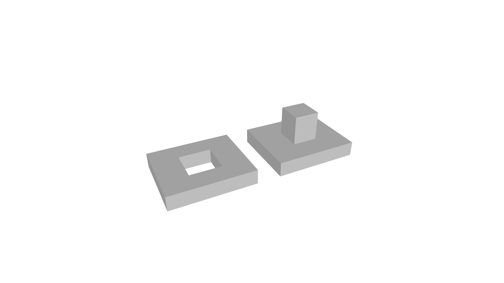
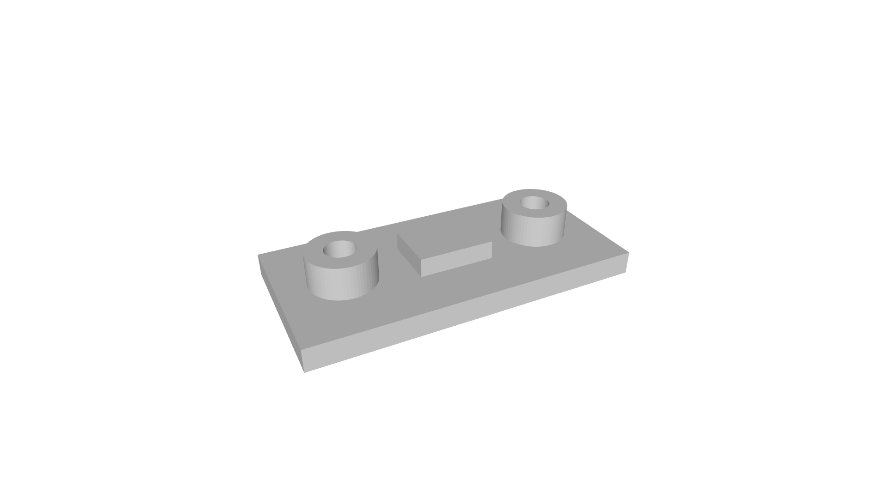
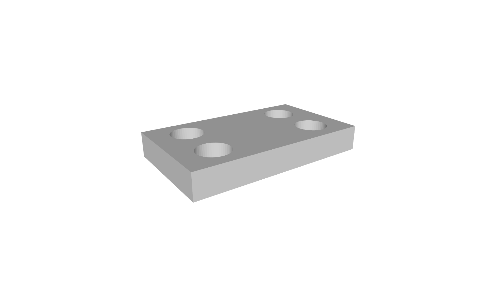
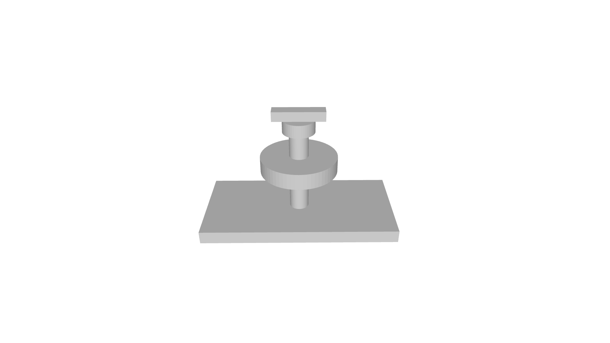
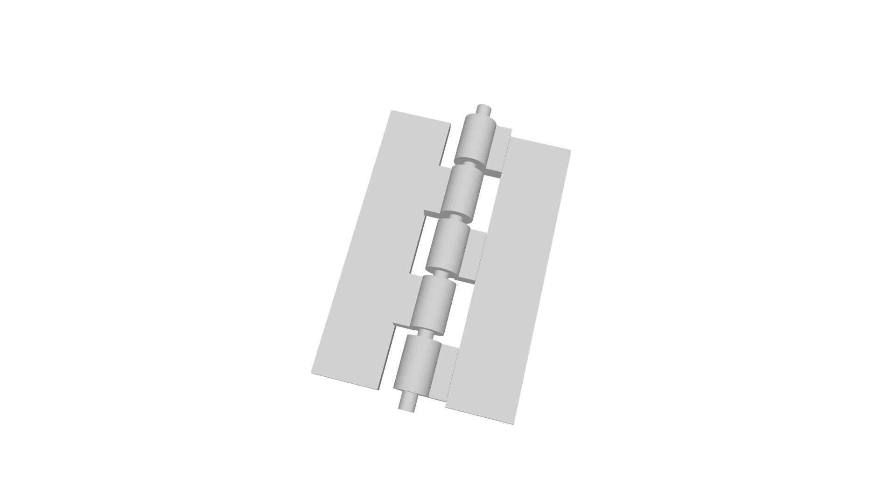
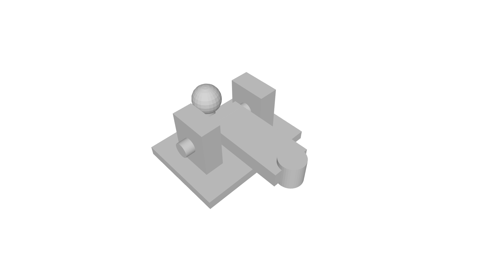
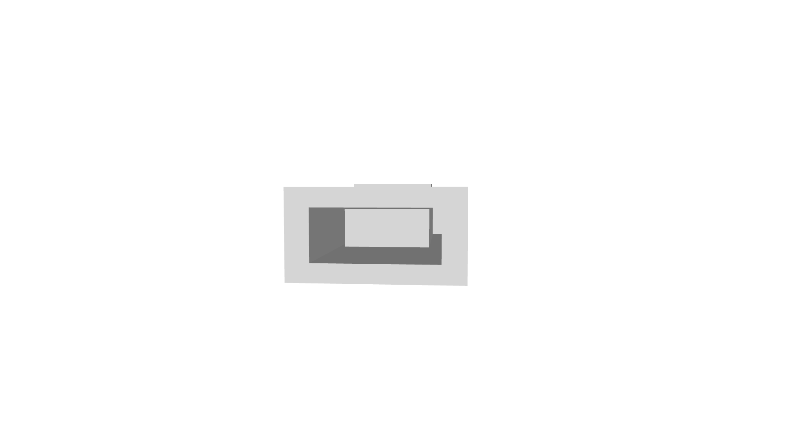
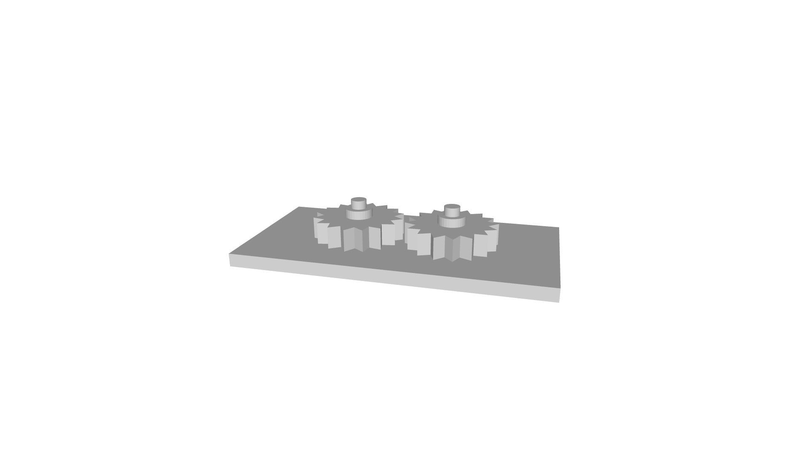
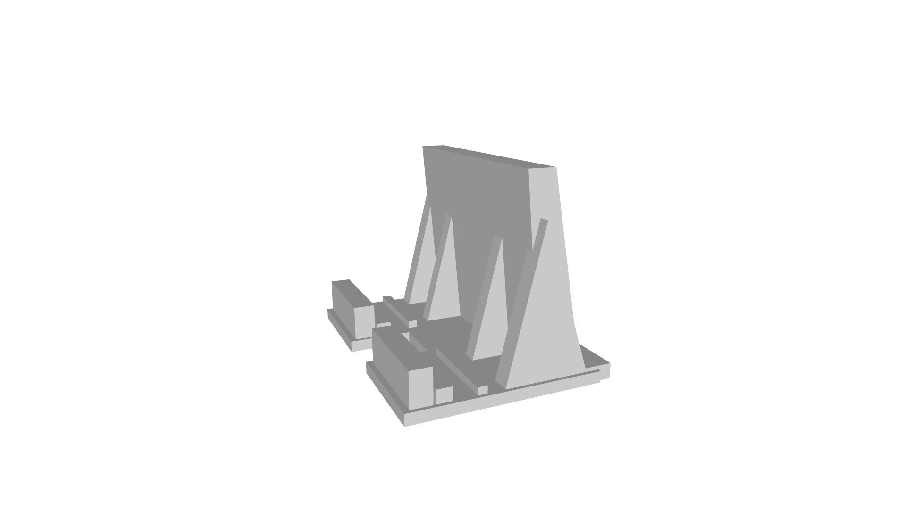

+++
draft = false
toc = true
math = false
isCJKLanguage = true
author = "최은광"
title = "08강 | 움직이는 구조"
description = "조립, 가동을 위한 설계"
date = 2026-05-22 00:00:00
expiryDate = 2099-12-31
techs = ["Blender Foundation/ Blender 5"]
languages = "한국어"
+++

블렌더 5 모델링의 기초 | 광진정보도서관 2026년 상반기 특강

<!--more--> 

# 1. 강의 개요

<h3>강의명</h3>

움직이는 구조  
— 조립, 가동을 위한 설계  

<h3>강의 목표</h3>

- 조립 가능한 구조를 설계할 수 있다
- 움직이는 구조의 기본 원리를 이해할 수 있다
- 출력 후 유지보수를 고려할 수 있다

<h3>실습의 흐름</h3>

1. 힌지 구조 — 회전축과 Clearance
2. 분리형 박스 — 조립 구조와 결합 방식
3. 기어 구조 — 회전 전달 구조
4. 태블릿 버티컬 거치대 — 하중 분산과 지지 구조
5. 전자기기 하우징 — 부품 결합과 분리 출력

 

# 2. 결합 구조

## 2.1 분리 출력의 필요성

한 덩어리로 된 거대한 구조는  
출력 시간이 길고, 수정이 어려우며,  
실패 위험이 크다.  

<h3>분리 출력의 장점</h3>

1. 출력 실패 감소  
   * 일부만 다시 출력 가능  

2. Support 감소  
   * 방향 최적화 가능  

3. 출력 품질 향상  
   * Surface 방향 조절 가능  

4. 유지보수 용이  
   * 부품 교체 가능  

<h3>분리 기준</h3>  

* 출력 방향  
* Overhang  
* 기능 구조  
* 조립 순서  
* 출력 크기 등  

## 2.2 조립 순서 설계

모델링은 가능하지만 실제로는 끼울 수 없거나  
조립이 불가능한 구조가 자주 발생한다.  
따라서 <mark>결합의 순서</mark>를 고려해야 한다.  

1. 가장 큰 구조부터 조립
2. 내부 부품 먼저 삽입
3. 외부 덮개는 마지막에 결합

<h3>결합 구조의 핵심</h3>

1. 조립이 쉽고
2. 흔들림이 적으며
3. 출력이 안정적이어야 한다.

<h3>설계 시 고려사항</h3>

1. 어느 방향으로 끼우는가?
2. 조립 중 간섭은 없는가?
3. 손으로 실제 조립 가능한가?
4. 출력 후 분리가 가능한가?

## 2.3 결합 구조의 실습

### 실습 1. 끼워맞춤 구조

— Clearance 기반 결합 구조 실습

1. Cube 생성
2. `Shift` + `D`로 복제
3. 첫 번째 Cube에 Difference용 슬롯 생성
4. 두 번째 Cube를 삽입용 구조로 축소
5. 슬롯과 삽입부 사이 간격을 0 ~ 0.5mm 로 비교
6. `N` 패널에서 실제 Dimensions 확인
7. 끼워맞춤 가능 여부 분석



#### 오류 1. 구조가 서로 끼워지지 않는다

원인

* Clearance 부족

해결

* 최소 0.2 ~ 0.3mm 여유 확보

#### 오류 2. 구조가 지나치게 흔들린다

원인

* Clearance 과다

해결

* 간격 감소
* 실제 출력 테스트 반복

#### 오류 3. 슬롯이 막힌다

원인

* Difference 깊이 부족
* 두께 부족

해결

* 슬롯 깊이 증가
* 바닥 두께 확인




[practice-08-01.stl](practice-08-01.stl)


### 실습 2. 나사 결합 구조

1. Cylinder 생성
2. Difference로 나사 구멍 생성
3. Boss 구조 추가
4. Screw Modifier 또는 단순 나사 구조 생성
5. 결합 방향 확인
6. 출력 방향 검토



#### 오류 1. 나사 구조가 깨진다

원인

* 메시 과다
* Clearance 부족

해결

* Steps 감소
* 간격 확보

### 오류 2. 출력 후 나사가 안 돌아간다

원인

* 출력 오차
* Clearance 부족

해결

* 0.3 ~ 0.4mm 여유 확보

#### 오류 3. Boss 구조가 부러진다

원인

* 두께 부족

해결

* Boss 직경 증가
* 바닥과 충분히 결합




[practice-08-02.stl](practice-08-02.stl)


### 실습 3. 자석 삽입 구조

1. Cube 생성
2. Cylinder 생성
3. Difference로 원형 홈 생성
4. 자석 크기 기준으로 홈 직경 조정
5. 깊이 조절
6. 실제 자석 삽입 가능 여부 분석



#### 오류 1. 자석이 들어가지 않는다

원인

* Clearance 부족

해결

* 직경 증가
* 최소 0.2mm 여유 확보

#### 오류 2. 자석이 너무 헐겁다

원인

* 홈 크기 과다

해결

* Difference 직경 감소

#### 오류 3. 바닥이 뚫린다

원인

* Difference 깊이 과다

해결

* 바닥 두께 확보




[practice-08-03.stl](practice-08-03.stl)


 

# 3. 움직이는 구조

## 3.1 회전축

축 구조는 “딱 맞는 구조”보다  
<mark>약간 여유 있는 구조</mark>가 중요  

1. 축의 직경
2. Clearance
3. 마찰
4. 회전 방향

<h3>회전축 구조 실습</h3>

1. Cylinder 생성
2. 회전축용 작은 Cylinder 생성
3. 중심 정렬
4. 축 직경 변경
5. Clearance 비교
6. 회전 가능 여부 분석



### 오류 1. 축이 회전하지 않는다

원인

* Clearance 부족

해결

* 최소 0.2~0.3mm 여유 확보

### 오류 2. 구조가 흔들린다

원인

* Clearance 과다

해결

* 간격 감소

### 오류 3. 축이 중심에서 벗어난다

원인

* Origin 또는 Snap 문제

해결

* Vertex Snap 사용
* 중심 정렬 재확인




[practice-08-04.stl](practice-08-04.stl)


## 3.2 힌지

힌지^Hinge^는 두 구조가 
한 축을 중심으로 회전하는 구조  
cf. 문, 덮개, 접이식 구조  

축 방향과 Layer 방향에 따라  
강도가 크게 달라진다.

1. 축 정렬
2. 회전 간격
3. 접촉 면적
4. 출력 방향

<h3>힌지 구조 실습</h3>

1. Plane 또는 Cube 생성
2. 힌지용 원통 구조 생성
3. 회전축 삽입
4. 축 간격 조정
5. 회전 방향 확인
6. 출력 방향 검토



### 오류 1. 힌지가 붙어버린다

원인

* Clearance 부족

해결

* 최소 0.3mm 간격 확보

### 오류 2. 축이 부러진다

원인

* 축 직경 부족

해결

* 축 두께 증가

### 오류 3. 회전이 부자연스럽다

원인

* 중심축 불일치

해결

* Snap으로 중심 정렬




[practice-08-05.stl](practice-08-05.stl)


## 3.3 관절

관절^Articulated Joint^은 다축 회전,  
방향 변화가 가능한 구조  

1. 회전 범위
2. 간섭 방지
3. 마찰
4. 축 방향

<h3>관절 구조 실습</h3>

1. 기본 암 구조 생성
2. 회전축 추가
3. 관절 연결부 생성
4. 회전 범위 확인
5. 구조 간섭 분석
6. 실제 움직임 테스트



### 오류 1. 구조가 서로 충돌한다

원인

* 회전 범위 고려 부족

해결

* 관절 간격 증가
* 회전 범위 제한

### 오류 2. 관절이 너무 약하다

원인

* 축 두께 부족

해결

* 회전축 직경 증가

### 오류 3. 움직임이 뻑뻑하다

원인

* Clearance 부족

해결

* 간격 증가




[practice-08-06.stl](practice-08-06.stl)


## 3.4 슬라이드

슬라이드^Slide Rail^는 직선 방향으로 이동하는 구조  
cf. 서랍, 레일, 슬라이드 커버  
아주 작은 오차도 문제가 될 수 있다.

1. 평행 정렬
2. 마찰 감소
3. Clearance
4. 레일 방향

<h3>슬라이드 구조 실습</h3>

1. 레일 구조 생성
2. 슬라이드 블록 생성
3. Snap으로 평행 정렬
4. Clearance 조정
5. 이동 방향 확인
6. 마찰 가능성 분석



### 오류 1. 슬라이드가 움직이지 않는다

원인

* Clearance 부족

해결

* 최소 0.3mm 이상 간격 확보

### 오류 2. 구조가 흔들린다

원인

* 레일 간격 과다

해결

* Clearance 감소

### 오류 3. 이동 중 걸린다

원인

* 평행 정렬 불량

해결

* Grid / Snap으로 정렬 재조정




[practice-08-07.stl](practice-08-07.stl)


## 3.5 기어 

기어는 회전 운동을 전달하는 구조  
한 기어가 회전하면 다른 기어가 반대 방향으로 회전  
메시 밀도, 톱니 두께, 출력 정밀도의 영향을 크게 받음

1. 톱니 간격
2. 중심 거리
3. 회전 방향
4. 마찰과 Clearance

<h3>기어 구조 실습</h3>

1. 기어 구조 생성
2. 중심 거리 조정
3. 기어 맞물림 확인
4. 회전 방향 분석
5. Clearance 조정
6. 실제 출력 가능성 검토



### 오류 1. 기어가 서로 끼인다

원인

* 중심 거리 부족

해결

* 거리 증가
* Clearance 확보

### 오류 2. 회전이 부드럽지 않다

원인

* 톱니 간격 문제

해결

* 기어 크기 및 톱니 수정

### 오류 3. 출력 후 톱니가 깨진다

원인

* 톱니 두께 부족

해결

* 톱니 두께 증가
* 출력 방향 변경




[practice-08-08.stl](practice-08-08.stl)


 

# 4. 태블릿 버티컬 거치대 설계

## 4.1 무게 중심과 하중

<h3>태블릿 거치대의 핵심 문제</h3>

태블릿 버티컬 거치대는 단순히 “세워 두는 물건”이 아니다.
무거운 태블릿을 뒤에서 지지해야 하므로 다음 조건을 함께 고려해야 한다.

* 태블릿의 무게
* 기울어진 방향
* 뒤로 넘어가는 힘
* 바닥면의 접지
* 지지대의 두께와 강도

즉, 태블릿 거치대는  

<mark>형태보다 하중을 먼저 고려해야 하는 기능형 구조</mark>

<h3>무게 중심</h3>

태블릿은 세워 놓으면 무게 중심이 위쪽에 위치한다.
따라서 바닥이 좁거나 뒤쪽 지지 구조가 약하면 쉽게 넘어질 수 있다.

안정적인 거치대를 만들려면:

1. 바닥면을 충분히 넓게 만든다
2. 뒤쪽 지지대를 길게 뻗는다
3. 태블릿이 기대는 각도를 지나치게 세우지 않는다
4. 바닥과 지지대가 충분히 두껍게 연결되도록 한다

<h3>하중이 걸리는 위치</h3>

태블릿 거치대에서 힘이 집중되는 위치는 보통 다음 세 곳이다.

1. 태블릿이 닿는 뒤 지지면
2. 하단 받침 홈
3. 바닥판과 뒤 지지대의 연결부

이 부분은 쉽게 부러지거나 휘어질 수 있으므로, 얇은 구조로 만들지 않는다.

## 4.2 뒤 지지 구조

<h3>뒤 지지 구조의 역할</h3>

뒤 지지 구조는 태블릿이 뒤로 넘어가지 않도록 받치는 부분이다.
태블릿이 무거울수록 이 구조는 더 중요하다.

<h3>좋은 뒤 지지 구조의 조건</h3>

1. 충분한 높이
   * 태블릿 뒷면을 안정적으로 받쳐야 한다

2. 충분한 두께
   * 얇으면 휘거나 부러질 수 있다

3. 바닥과 넓게 연결
   * 지지대만 튼튼해도 바닥과 연결부가 약하면 실패한다

4. 기울어진 형태
   * 완전 수직보다 약간 뒤로 기울어진 구조가 안정적이다

<h3>보강 리브</h3>

뒤 지지대가 높을수록 보강 리브가 필요하다.

보강 리브는

<mark>얇은 벽 구조가 휘거나 부러지는 것을 막기 위한 삼각 지지 구조</mark>

태블릿 거치대에서는 뒤 지지대 양쪽 또는 중앙에 리브를 추가하면 안정성이 크게 높아진다.

## 4.3 접지 면적

<h3>접지 면적이란?</h3>

접지 면적은 바닥에 닿는 부분의 넓이를 의미한다.

태블릿 거치대는 무게가 위쪽과 뒤쪽으로 쏠리기 때문에, 접지 면적이 작으면 쉽게 흔들리거나 넘어질 수 있다.

<h3>접지 면적이 부족할 때 생기는 문제</h3>

* 거치대가 뒤로 넘어짐
* 출력 중 바닥에서 들뜸
* 사용 중 흔들림
* 태블릿을 넣고 뺄 때 구조가 밀림

<h3>접지 면적 확보 방법</h3>

1. 바닥판을 넓게 만든다
2. 뒤쪽으로 바닥을 연장한다
3. 앞쪽에는 태블릿이 빠지지 않도록 턱을 만든다
4. 바닥면 아래의 불필요한 돌출을 제거한다

<h3>출력 관점</h3>

접지 면적은 사용 안정성뿐 아니라 출력 안정성에도 중요하다.

* 넓은 바닥면 → 출력 안정
* 작은 접지면 → 들뜸 가능성 증가

따라서 태블릿 거치대는 가능한 한  

<mark>넓고 평평한 바닥면을 가진 구조</mark>

로 설계하는 것이 좋다.

## 4.4 Overhang 최소화

<h3>태블릿 거치대와 Overhang</h3>

뒤 지지대를 기울여 만들면 Overhang 문제가 발생할 수 있다.
특히 지지대가 수평에 가깝거나 공중으로 길게 뻗으면 서포트가 필요해질 수 있다.

<h3>Overhang을 줄이는 방법</h3>

1. 지지대를 완전히 눕히지 않는다
2. 45도에 가까운 경사 구조를 사용한다
3. 삼각 리브를 추가한다
4. 필요하면 부품을 나누어 출력한다
5. 출력 방향을 바꾸어 서포트를 줄인다

<h3>Support-Free 방향</h3>

태블릿 거치대는 가능하면 Support-Free 구조로 설계하는 것이 좋다.

Support가 많으면:

* 출력 시간이 길어지고
* 표면이 거칠어지고
* 후처리가 필요해진다.

따라서 뒤 지지대는

<mark>서포트 없이 출력 가능한 각도와 구조</mark>

를 기준으로 설계한다.

## 4.5 태블릿 삽입 각도

<h3>삽입 각도의 의미</h3>

태블릿이 서 있는 각도는 사용성과 안정성에 모두 영향을 준다.

너무 세우면:

* 뒤로 넘어질 가능성이 크다
* 뒤 지지대에 하중이 집중된다

너무 눕히면:

* 화면을 보기 어렵다
* 거치대가 커진다
* Overhang이 증가할 수 있다

<h3>권장 방향</h3>

입문 실습에서는 태블릿이 약간 뒤로 기대는 구조를 사용한다.

예:

* 수직에 가까운 직각 구조보다 안정적
* 완전히 눕는 구조보다 출력이 쉬움
* 뒤 지지대와 바닥판 연결이 명확함

<h3>하단 턱</h3>

태블릿을 세울 때 앞쪽에는 작은 턱이 필요하다.

하단 턱은:

* 태블릿이 앞으로 미끄러지는 것을 막고
* 삽입 위치를 고정하며
* 거치 각도를 안정화한다.

단, 너무 높은 턱은 화면이나 버튼을 가릴 수 있으므로 적절한 높이로 만든다.

## 4.6 케이블 공간 확보

<h3>케이블 공간이 필요한 이유</h3>

태블릿을 세로로 거치할 경우, 충전 케이블이 아래쪽에 연결될 수 있다.

이때 바닥판 중앙이 막혀 있으면:

* 케이블이 꺾임
* 태블릿이 제대로 들어가지 않음
* 하단 접촉부가 불안정해짐

<h3>케이블 홈</h3>

케이블 공간은 보통 중앙 홈으로 만든다.

제작 방식

* Boolean Difference로 홈 생성
* 바닥판 중앙을 비워 둠
* 앞 턱을 좌우로 분리

<h3>주의점</h3>

케이블 홈을 만들 때는 다음을 확인한다.

1. 홈 폭이 충분한가
2. 홈 주변 바닥 두께가 충분한가
3. 앞 턱이 너무 약해지지 않는가
4. 케이블이 지나가는 방향이 자연스러운가

## 4.7 Support-Free 설계

<h3>Support-Free 설계란?</h3>

Support-Free 설계는:

<mark>서포트 없이 출력되도록 구조를 미리 조정하는 방식</mark>

태블릿 거치대처럼 큰 구조물에서는 Support를 줄이는 것이 매우 중요하다.

<h3>Support-Free 설계 전략</h3>

1. 넓은 바닥을 아래로 둔다
2. 뒤 지지대는 완만한 경사로 만든다
3. 삼각 리브를 사용한다
4. 수평 돌출부를 줄인다
5. 필요하면 부품을 분리한다

<h3>태블릿 거치대에서의 적용</h3>

태블릿 거치대는 다음 방식으로 Support-Free에 가깝게 설계할 수 있다.

* 바닥판은 평평하게 출력
* 뒤 지지대는 경사 구조로 제작
* 지지대 뒤쪽에 삼각 리브 추가
* 앞 턱은 짧고 단단하게 제작
* 케이블 홈은 바닥면을 완전히 약하게 만들지 않도록 조정

<h3>태블릿 버티컬 거치대</h3>

1. Cube 생성
2. `S` → X, Y 방향으로 넓은 바닥판 생성
3. `S` → Z 방향으로 얇게 조정하여 기본 바닥 구조 생성
4. 앞쪽에 작은 턱 구조 생성
5. 중앙에 케이블 홈을 만들기 위해 Boolean Difference용 Cube 배치
6. 바닥판에 Boolean Difference 적용
7. 뒤쪽에 기울어진 지지대 생성
8. 지지대 양쪽에 삼각 보강 리브 추가
9. 뒤쪽으로 바닥판을 확장하여 넘어짐 방지 구조 생성
10. 전체 구조의 접지 면적 확인
11. Overhang이 과도한 부분이 있는지 확인
12. STL Export 후 3D WOX에서 바닥 정렬, 서포트, 출력 방향 확인



### 오류 1. 태블릿이 뒤로 넘어질 것 같은 구조가 된다

원인

* 바닥판이 너무 짧음
* 뒤 지지대가 너무 수직에 가까움
* 접지 면적 부족

해결

* 바닥판을 뒤쪽으로 확장
* 뒤 지지대를 약간 기울임
* 보강 리브 추가

### 오류 2. 뒤 지지대가 약해 보인다

원인

* 지지대 두께 부족
* 바닥판과의 연결 면적 부족

해결

* 지지대 두께 증가
* 삼각 리브 추가
* 연결부를 넓게 설계

### 오류 3. 앞쪽 턱이 태블릿을 충분히 잡지 못한다

원인

* 턱 높이가 낮음
* 턱 위치가 너무 앞쪽 또는 뒤쪽에 있음

해결

* 턱 높이 조정
* 태블릿 두께를 기준으로 위치 재조정
* 필요 시 턱을 좌우로 분리하여 케이블 공간 확보

### 오류 4. 케이블 홈 때문에 구조가 약해진다

원인

* 홈 폭이 너무 큼
* 홈 주변 바닥 두께 부족
* 앞 턱이 완전히 분리되어 약해짐

해결

* 홈 폭을 필요한 만큼만 확보
* 좌우 바닥 두께를 충분히 남김
* 앞 턱을 좌우 구조로 보강

### 오류 5. 서포트가 많이 생긴다

원인

* 뒤 지지대 또는 턱의 Overhang이 큼
* 수평 돌출 구조가 많음

해결

* 지지대 각도 조정
* 삼각 리브 추가
* 출력 방향 재검토

### 오류 6. 3D WOX에서 크기가 너무 크다

원인

* Blender Scale 미적용
* 실제 태블릿 크기 기준 미확인

해결

* `Ctrl` + `A` → Scale 적용
* N 패널에서 Dimensions 확인
* 3D WOX에서 mm 기준 크기 재확인




[practice-08-09.stl](practice-08-09.stl)

